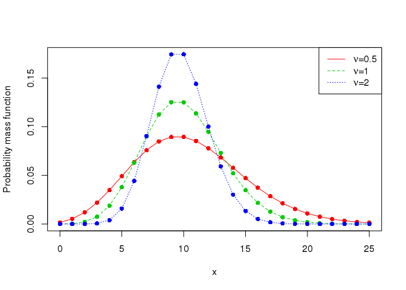

combayes
========

combayes implements Bayesian inference for COM-Poisson regression models
using exact samplers. It also provides functions for sampling exactly
from the COM-poisson distribution (using rejection sampling) and for
evaluating exact bounds for the normalisation constant of the
probability mass function of the COM-Poisson distribution. More
information behind the techniques used can be found in the papers:

-   [Retrospective sampling in MCMC with an application to COM-Poisson
    regression (2014)](http://www.maths.gla.ac.uk/~cchanialidis/Slides_and_Papers/cmpstat.pdf)
-   [Efficient Bayesian inference for COM-Poisson regression
    models (2017)](https://link.springer.com/article/10.1007/s11222-017-9750-x)

Both papers focus on the Bayesian implementation of the COM-Poisson
regression model. The latter paper takes advantage of the [exchange
algorithm](https://dslpitt.org/uai/papers/06/p359-murray.pdf), an MCMC
method applicable to situations where the sampling model (likelihood)
can only be computed up to a normalisation constant. The algorithm
requires to draw from the sampling model, which in the case of the
COM-Poisson distribution can be done efficiently using rejection
sampling.

If you want to get a really short intro to the COM-Poisson distribution
enter the URL of the README.html document at
<http://htmlpreview.github.io/>.

<!-- COM-Poisson distribution -->
<!-- ------------------------ -->
<!-- The COM-Poisson distribution is a two-parameter generalisation of the Poisson distribution that allows for different levels of dispersion. The discrete random variable $Y$ is said to be COM-Poisson($\mu,\nu$) distributed if its probability mass function is -->
<!-- $$P(Y=y|\mu, \nu)=\left(\frac{\mu^y}{y!}\right)^\nu\frac{1}{Z(\mu, \nu)} \quad y=0, 1, 2, \ldots$$ -->
<!-- with  $Z(\mu, \nu)=\displaystyle \sum_{j=0}^{\infty}\left(\frac{\mu^j}{j!}\right)^\nu$ for $\mu >0$ and $\nu \ge 0$. -->
<!--  The parameter $\nu$ governs the amount of dispersion: the Poisson distribution is recovered when $\nu=1$, while overdispersion corresponds to $\nu < 1$ and underdispersion to $\nu > 1$.  The normalisation constant $Z(\mu, \nu)$ does not have a closed form (for $\nu\neq 1$) and has to be approximated, but can be lower and upper bounded. -->
<!-- The  mode of the COM-Poisson distribution is $\lfloor{\mu} \rfloor$ whereas the mean and variance of the distribution can be approximated by -->
<!-- $$\mathbb{E}[Y]\approx \mu + \frac{1}{2\nu}-\frac{1}{2}, \quad  \quad \quad  \mathbb{V}[Y]\approx \frac{\mu}{\nu}.$$ -->
<!-- Thus $\mu$ closely approximates the mean, unless $\mu$ or $\nu$ (or both) are small. -->

Are you still confused about the COM-Poisson distribution and the
exchange algorithm? Have a look at these
[slides](https://cchanial.shinyapps.io/intro_to_compoisson/).

Installing the package in R
---------------------------

``` r
library(devtools)
install_github("cchanialidis/combayes")
```

All you need to do now, I hope, is

``` r
library(combayes)
```

Sampling from COM-Poisson distributions with different dispersion levels
------------------------------------------------------------------------

``` r
# Set random seed for reproducibility
set.seed(84)
# Sample size
n <- 200 
# Sampling from an underdispersed COM-Poisson distribution
comp_under <- rcmpois(mu=10,nu=2,n=n)
# Sampling from a COM-Poisson distribution where nu=1 (i.e. Poisson distribution)
comp_equi <- rcmpois(mu=10,nu=1,n=n)
# Sampling from an overdispersed COM-Poisson distribution
comp_over <- rcmpois(mu=10,nu=0.5,n=n)
# Save samples in a data frame
distributions <- data.frame(comp_under,comp_equi,comp_over)
```

``` r
apply(distributions,2,mean)# Similar means (close to the value of mu)
```

    ## comp_under  comp_equi  comp_over 
    ##      9.855     10.105     10.480

``` r
apply(distributions,2,var)# Different variances (close to the value of mu/nu)
```

    ## comp_under  comp_equi  comp_over 
    ##   4.757764   8.385905  19.647839

<!-- This is a good time to ask "Why are the means and variances approximately equal to $\mu$ and $\frac{\mu}{\nu}$?"It's also a good time for my "Why didn't you look at the papers I linked earlier" comeback. -->

Estimating the logarithm of the normalisation constant
------------------------------------------------------

``` r
logzcmpois(mu=10,nu=2)
logzcmpois(mu=10,nu=1)# Any ideas on what we expect the answer to be for nu=1?
logzcmpois(mu=10,nu=0.5)
```

Estimating the probability mass function
----------------------------------------

``` r
# Compare densities of COM-Poisson distribution with different nu
 x <- 0:25

matplot(x, cbind(dcmpois(x, mu=10, nu=0.5),
                 dcmpois(x, mu=10, nu=1),
                  dcmpois(x, mu=10, nu=2)), type="o", col=2:4, pch=16, ylab="Probability mass function") 

legend("topright", col=2:4, lty=1:3, c(expression(nu*"="*0.5),
                                        expression(nu*"="*1),
                                        expression(nu*"="*2)))
```



COM-Poisson regression model
============================

<!-- We consider the following COM-Poisson regression model: -->
<!-- $$ -->
<!--  \begin{align*} -->
<!--  P(Y_i=y_i|\mu_i, \nu_i)&=\left(\frac{\mu_i^{y_i}}{y_{i}!}\right)^{\nu_i}\frac{1}{Z(\mu_i, \nu_i)},&&\\ -->
<!--  \log{\mu_i}&= \hspace{0.3cm} \boldsymbol{x}_i^\intercal\boldsymbol{\beta} \Rightarrow&&  \mathbb{E}[Y_i]\approx  \exp{\{\boldsymbol{x}_i^\intercal\boldsymbol{\beta}\}},\\ -->
<!--  \log{\nu_i}&= -\boldsymbol{x}_i^\intercal\boldsymbol{\delta} \Rightarrow&&  \mathbb{V}[Y_i]\approx   \exp{\{ \boldsymbol{x}_i^\intercal\boldsymbol{\beta}+\boldsymbol{x}_i^\intercal\boldsymbol{\delta}\}}, -->
<!--   \end{align*} -->
<!-- $$ -->
<!-- where $Y$ is the dependent random variable being modelled, while $\boldsymbol{\beta}$ and $\boldsymbol{\delta}$ are the regression coefficients for the centering link function and the shape link function. Larger values of $\boldsymbol{\beta}$ and $\boldsymbol{\delta}$ can be translated to higher mean and higher variance for the response variable. As previously mentioned, the approximations on the mean and variance in are accurate when  $\mu$ and $\nu$ are not small (e.g. extreme overdispersion). -->

We illustrate the method and the benefits of using a Bayesian
COM-Poisson regression model, through two real-world data sets with
different levels of dispersion. If one wants to use the alternative
technique proposed in the earlier paper they have to specify that the
argument `algorithm` in the `cmpoisreg` is equal to `"bounds"` (in its
default version is equal to `"exchange"`). Bear in mind that the MCMC
algorithm will be significantly slower in that case.

Application I: To be updated soon
---------------------------------

<!-- Application I: Fertility data -->
<!-- ----------------- -->
<!-- ```{r eval=FALSE} -->
<!-- # Load data from library Countr -->
<!-- library(Countr) -->
<!-- data(fertility) -->
<!-- # Standardise all non-binary covariates -->
<!-- fertility[,c(3,7,9)] <- scale(fertility[,c(3,7,9)],center=TRUE,scale=TRUE) -->
<!-- result <- cmpoisreg(y=fertility$children, X=fertility[,-1]-1, num_samples=1e4, burnin=1e3) -->
<!-- colMeans(result$posterior_beta) -->
<!-- colMeans(result$posterior_delta) -->
<!-- # Load packages for MCMC diagnostics -->
<!-- library(coda) -->
<!-- library(mcmcplots) -->
<!-- mcmc_beta  <- mcmc(result$posterior_beta) -->
<!-- mcmc_delta <- mcmc(result$posterior_delta) -->
<!-- colnames(mcmc_beta) <-  c("intercept","German","schooling","vocational education","University","Catholic","Protestant","Muslim","rural","age","age at marriage") -->
<!-- colnames(mcmc_delta) <- colnames(mcmc_beta) -->
<!-- # Plot traceplots of regression coefficients -->
<!-- plot(mcmc_beta) -->
<!-- plot(mcmc_delta) -->
<!-- # Plot caterplots of regression coefficients -->
<!-- caterplot(mcmc_beta,style="plain",bty="n",collapse=FALSE) -->
<!-- abline(v=0,lty=2) -->
<!-- title("Regression coefficients for"~ mu) -->
<!-- caterplot(mcmc_delta,style="plain",bty="n",collapse=FALSE) -->
<!-- abline(v=0,lty=2) -->
<!-- title("Regression coefficients for"~ nu) -->
<!-- ``` -->

Application II: PhD publications data
-------------------------------------

``` r
# Load data from library Rchoice
library(Rchoice)
data(Articles)
# Focusing only on the students with at least one publication
phdpublish <- subset(Articles, art>0)
phdpublish <- transform(phdpublish, art=art-1)
# Standardise all non-binary covariates
phdpublish <- cbind(phdpublish[,c(1,2,3)],scale(phdpublish[,-c(1,2,3)],center=TRUE,scale=TRUE))
result <- cmpoisreg(y=phdpublish$art, X=phdpublish[,2:6], num_samples=1e4, burnin=1e3,prior_var_beta=diag(6),prior_var_delta=diag(6))
colMeans(result$posterior_beta)
colMeans(result$posterior_delta)
mcmc_beta  <- mcmc(result$posterior_beta)
mcmc_delta <- mcmc(result$posterior_delta)
colnames(mcmc_beta) <- c("intercept","female","married","kids","phd","mentor")
colnames(mcmc_delta) <- colnames(mcmc_beta)
# Plot traceplots of regression coefficients
plot(mcmc_beta)
plot(mcmc_delta)
# Plot caterplots of regression coefficients
caterplot(mcmc_beta,style="plain",bty="n",collapse=FALSE)
abline(v=0,lty=2)
title("Regression coefficients for"~ mu)
caterplot(mcmc_delta,style="plain",bty="n",collapse=FALSE)
abline(v=0,lty=2)
title("Regression coefficients for"~ nu)
```

TMI
===

COM-Poisson
-----------

A talk by [Galit Shmueli](http://www.galitshmueli.com/) on the
COM-Poisson distribution can be found
[here](http://videolectures.net/solomon_shmueli_count_data/?q=com-poisson).

If you prefer reading papers instead, here are some starting points:

-   [Computing with the COM-Poisson
    distribution (2003)](http://www.stat.cmu.edu/tr/tr776/tr776.pdf)
-   [A useful distribution for fitting discrete data: revival of the
    Conway-Maxwell-Poisson
    distribution (2005)](https://pdfs.semanticscholar.org/87b8/5cfea2b894966a3600eb8495b840c3c1b2de.pdf)
-   [Conjugate analysis of the Conway-Maxwell-Poisson
    distribution (2006)](http://projecteuclid.org/download/pdf_1/euclid.ba/1340371067)
-   [Application of the Conway-Maxwell-Poisson generalized linear model
    for analysing motor vehicle
    crashes (2008)](http://www.sciencedirect.com/science/article/pii/S0001457507002163)
-   [A flexible count data regression model for risk
    analysis (2008)](http://onlinelibrary.wiley.com/doi/10.1111/j.1539-6924.2008.01014.x/full)
-   [A flexible regression model for count
    data (2010)](https://arxiv.org/abs/1011.2077)
-   [The COM-Poisson model for count data: a survey of methods and
    applications (2012)](http://faculty.georgetown.edu/kfs7/MY%20PUBLICATIONS/COMPoissonModelForCountDataWithDiscussion.pdf)
-   [The exponential COM-Poisson
    distribution (2012)](https://link.springer.com/article/10.1007/s00362-011-0370-9)
-   [Data dispersion: Now you see it… now you
    don’t (2013)](http://www.tandfonline.com/doi/abs/10.1080/03610926.2011.621575)
-   [The zero-inflated Conway-Maxwell-Poisson distribution: Bayesian
    inference, regression modeling and influence
    diagnostic (2014)](http://www.sciencedirect.com/science/article/pii/S1572312714000148)
-   [A COM-Poisson-type generalization of the negative binomial
    distribution (2014)](http://www.tandfonline.com/doi/abs/10.1080/03610926.2014.917184?journalCode=lsta20)
-   [Modeling bimodal discrete data using Conway-Maxwell-Poisson mixture
    models (2014)](http://www.tandfonline.com/doi/full/10.1080/07350015.2014.949343?src=recsys)
-   [Extended Conway-Maxwell-Poisson distribution and its properties and
    applications (2016)](https://jsdajournal.springeropen.com/articles/10.1186/s40488-016-0044-1)
-   [Bivariate Conway-Maxwell-Poisson distribution: Formulation,
    properties, and
    inference (2016)](http://www.sciencedirect.com/science/article/pii/S0047259X16300215)

Regression models for count data in R
-------------------------------------

I have to add a lot of info on this subsection but until then;
[here](http://ftp.uni-bayreuth.de/math/statlib/R/CRAN/doc/vignettes/pscl/countreg.pdf)
is a really informative paper that outlines the theory and the
implementation of regression models for count data in R.

Finally, [Joseph M. Hilbe](https://en.wikipedia.org/wiki/Joseph_Hilbe)
released the
[COUNT](https://cran.r-project.org/web/packages/COUNT/index.html)
package which contains lots of data sets where the response variable is
discrete.
